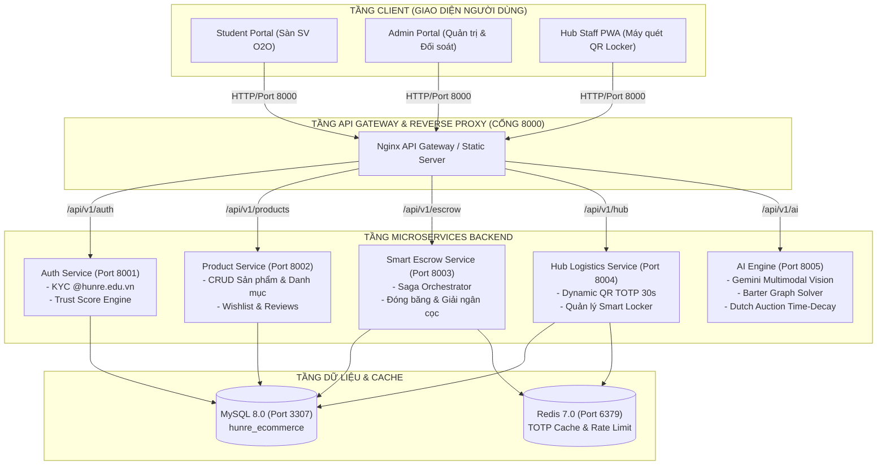
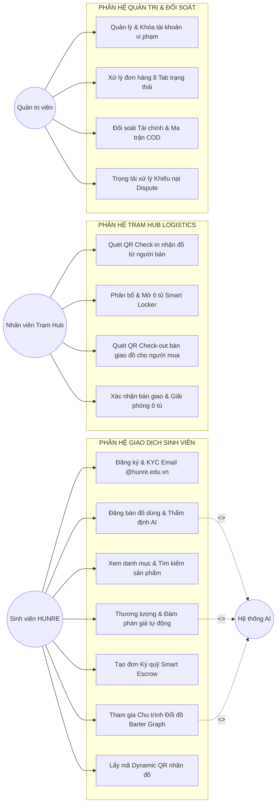
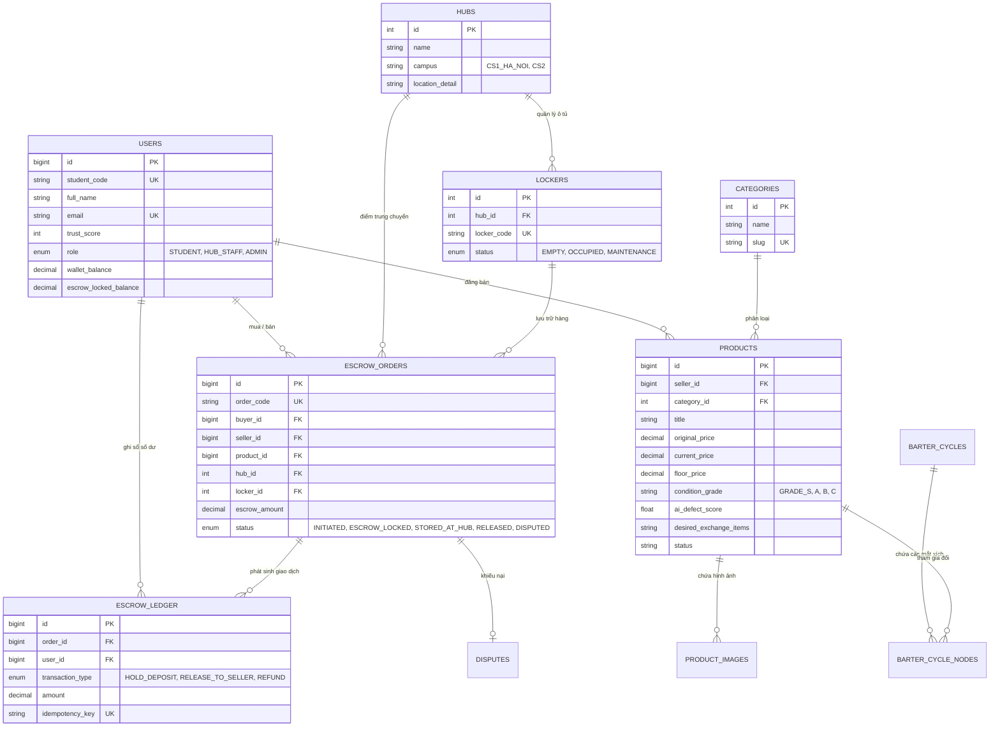
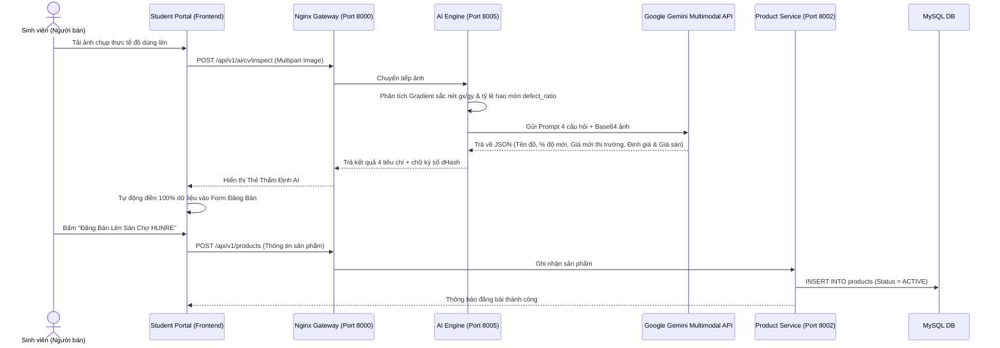
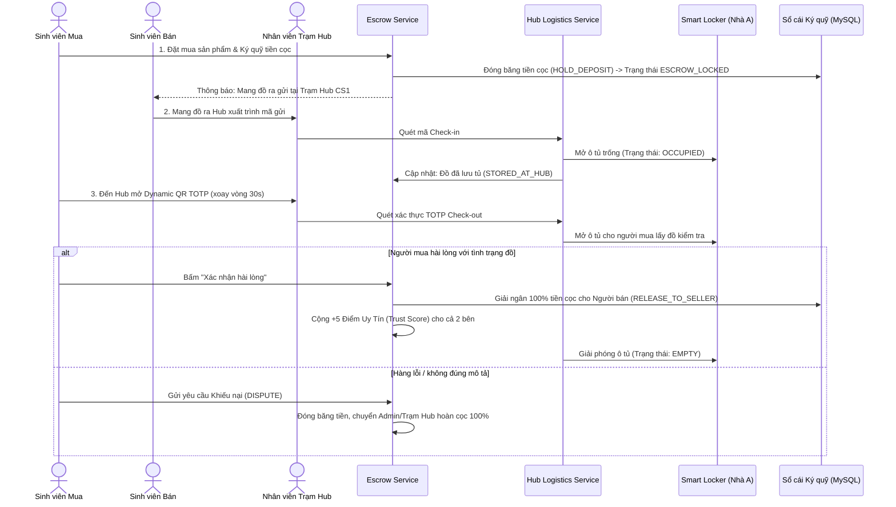
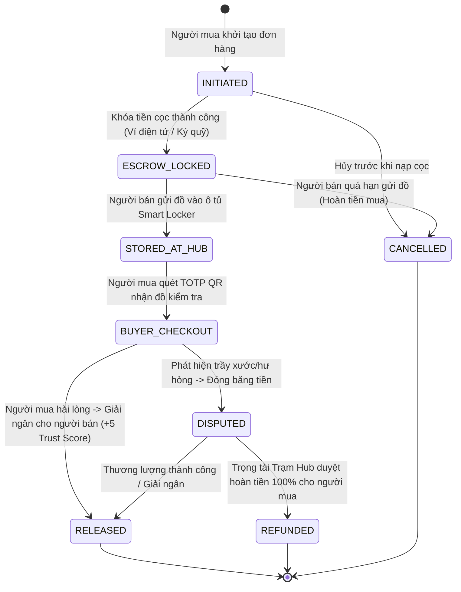
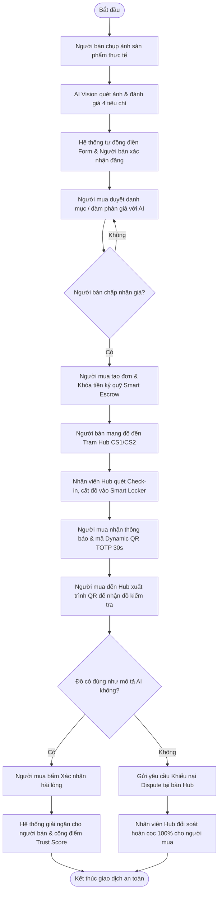

# TÀI LIỆU PHÂN TÍCH VÀ THIẾT KẾ HỆ THỐNG (UML & SYSTEM ARCHITECTURE)
## Đề Tài: Sàn Giao Dịch & Trao Đổi Đồ Dùng Học Tập Sinh Viên HUNRE (Mô Hình O2O & AI)
- **Trường:** Đại học Tài nguyên và Môi trường Hà Nội (HUNRE)
- **Khoa:** Công Nghệ Thông Tin
- **Môn học:** Phân tích & Thiết kế Hệ thống Thông tin / Công nghệ Phần mềm

---

## 1. SƠ ĐỒ KIẾN TRÚC HỆ THỐNG (MICROSERVICES ARCHITECTURE DIAGRAM)

Hệ thống được thiết kế theo kiến trúc Microservices chuẩn Enterprise, đóng gói hoàn chỉnh bằng Docker & Docker Compose:

---

## 2. SƠ ĐỒ CA SỬ DỤNG (USE CASE DIAGRAM)

### 2.1. Phân loại tác nhân (Actors)
1. **Sinh viên HUNRE (Student):** Vừa đóng vai trò Người mua (Buyer) vừa là Người bán (Seller).
2. **Nhân viên Trạm Hub (Hub Staff):** Đoàn Thanh niên trực trạm bàn giao đồ và vận hành ô tủ thông minh.
3. **Quản trị viên (Admin):** Quản lý đối soát tài chính, đơn hàng, khóa tài khoản vi phạm.
4. **Hệ thống AI (AI Service Agent):** Thẩm định ảnh đồ cũ 4 tiêu chí, gợi ý giá, giải thuật toán hoán đổi đồ.

---

## 3. SƠ ĐỒ THỰC THỂ LIÊN KẾT (ENTITY RELATIONSHIP DIAGRAM - ERD)

---

## 4. CÁC SƠ ĐỒ TUẦN TỰ NGHIỆP VỤ (SEQUENCE DIAGRAMS)

### 4.1. Luồng Thẩm Định Hình Ảnh AI 4 Tiêu Chí & Tự Động Điền Form Đăng Bán

### 4.2. Luồng Ký Quỹ Thông Minh Smart Escrow & Giao Nhận O2O Tại Trạm Hub

---

## 5. SƠ ĐỒ CHUYỂN TRẠNG THÁI (STATE MACHINE DIAGRAM)

---

## 6. SƠ ĐỒ HOẠT ĐỘNG (ACTIVITY DIAGRAM)

